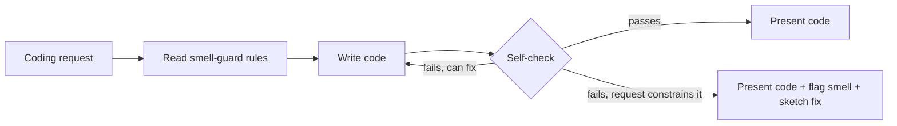

# smell-guard

A coding standard for AI agents that stops code smells from being written in the first place.

AI assistants write code fast, and they introduce code smells just as fast: god services,
`if/else` chains on type, `any` everywhere, business logic in controllers. smell-guard puts
the review checklist in front of the agent *before* the code exists. The agent reads the
rules, writes against them, and runs a self-check before showing you anything. Most smells
never reach review.

It covers all five [refactoring.guru](https://refactoring.guru/refactoring/smells) smell
categories, plus stack-specific rules for **Angular**, **NestJS**, **Express**,
**MongoDB/Mongoose** and **MSSQL (SQL Server)**.

Works with **Claude Code**, **Cowork**, and **GitHub Copilot in VS Code** (agent mode and chat).

## Quick start

**1. Get the files.** Clone this repo, or unzip the download you were given. The commands
below run from its root folder.

```bash
git clone https://github.com/mosmar/skills.git && cd skills
```

**2. Install for your agent.** Run `./install.sh` and pick **Guard**, or pass the choices
directly:

```bash
# GitHub Copilot
./install.sh --copilot --global guard                      # every repo, nothing to commit
./install.sh --copilot --project --dir <repo> guard        # one repo, commit .github/skills/

# Claude Code
./install.sh --claude --global guard                       # every project, nothing to commit
./install.sh --claude --project --dir <project> guard      # one project, commit .claude/skills/
```

Use `all` instead of `guard` to add the smell-scanner group too (recommended).

For more options, see [Install reference](#install-reference), including a manual install,
always-on Copilot instructions, and instructions that apply only to TS/HTML/CSS files.

## How to trigger it

smell-guard is a *standard*, not a report, so there's no special phrase to trigger it. Once
it's installed, the agent picks it up on ordinary coding requests.

### Claude Code / Cowork

- *"Add a cancel-order endpoint to the orders module"*
- *"Build an Angular component that lists the user's orders with a status filter"*
- *"Refactor this service so it's easier to test"*
- *"Write this following smell-guard"* (to invoke it explicitly)

### GitHub Copilot (VS Code agent mode)

- *"Add a PATCH /orders/:id/cancel route to #file:src/routes/orders.js"*
- *"Create a NestJS OrdersModule with create and list endpoints"*
- *"Refactor #selection into a presentational component"*
- *"Use the smell-guard skill while implementing this"*

## How it works



1. **Read.** Before writing, the agent loads the rules for the five smell categories and
   the stack.
2. **Write.** It applies the rules while generating code, not afterwards.
3. **Self-check.** It runs a checklist of about 30 items, grouped by category.
4. **Fix or flag.** If a check fails and the agent has room to fix it, it fixes it. If the
   request forces the smell (for example "add one more case to this switch"), it does what
   was asked, flags the smell and sketches the cleaner version.

## What it enforces

### The five smell categories

| Category | Smell | Rule the agent follows |
|---|---|---|
| **Bloaters** | Long Method | One job per function. A section comment (`// validate`) means extract a function |
| | Large Class | Name the single responsibility first. More than ~4 injected dependencies is too many |
| | Long Parameter List | Max 3–4 params, then use a parameter object. No boolean flag params |
| | Primitive Obsession | Enums or string-literal unions for statuses and roles. Branded types or value classes only if the project already uses them |
| | Data Clumps | 3+ values that always travel together become a named type |
| **OO Abusers** | Switch Statements | No repeated `if/else` or `switch` on type/kind/role. Use polymorphism, a discriminated union with an exhaustive check, or a strategy map |
| | Temporary Field | No fields that are only valid after some method runs. Return values instead |
| | Refused Bequest | No subclass that stubs out or throws on inherited methods |
| | Alternative Classes | Same job means same interface (`getUser` vs `fetchUser` gets aligned) |
| **Change Preventers** | Divergent Change | One reason to change per class. Split unrelated concerns early |
| | Shotgun Surgery | Each concept has one home, not 5+ files to edit |
| | Parallel Hierarchies | No `XxxNotification` + `XxxHandler` pairs growing in lockstep |
| **Dispensables** | Duplicate Code | Write logic once. Put the variation in a parameter |
| | Lazy Class | No class that only wraps a single call (framework units like feature modules and DTOs are exempt) |
| | Data Class | Objects own their behavior, not just getters and setters (schemas, entities and DTOs follow the project's convention) |
| | Dead Code | No commented-out blocks or unused methods |
| | Speculative Generality | No abstraction until the second real case exists |
| | Comments | Comments explain *why*, never *what* |
| **Couplers** | Feature Envy | A method that mostly uses another object's data moves to that object |
| | Inappropriate Intimacy | No reaching into another class's internals |
| | Message Chains | Max one hop: `order.getShippingCity()`, not `order.getCustomer().getAddress().getCity()` |
| | Middle Man | No class that only forwards calls (the framework's controller → service → repository layers are kept) |

### Stack specifics

| Stack | Rule | Smell it prevents |
|---|---|---|
| **Angular** | No `HttpClient` in components. Data access goes in a service | Large Class, Divergent Change |
| | Split container components from presentational ones | Divergent Change |
| | No method calls in template bindings. Use pure pipes, `computed()` or fields | Long Method, Duplicate Code |
| | No `SharedService` / `UtilsService` catch-alls | Large Class |
| | No `any`. Typed reactive forms. Statuses as string-literal unions | Primitive Obsession |
| | Styles: tokens for repeated values, no `::ng-deep` / `!important`, shallow selectors | Duplicate Code, Inappropriate Intimacy |
| **NestJS** | Thin controllers that delegate to one service call | Long Method, Divergent Change |
| | `class-validator` DTOs + `ValidationPipe`, no manual checks | Duplicate Code |
| | Throw `HttpException` subclasses or use exception filters, no per-handler try/catch | Duplicate Code |
| | Guards, interceptors and pipes for cross-cutting concerns | Shotgun Surgery |
| | Config through `ConfigService` or the project's config module, never scattered `process.env` | Shotgun Surgery |
| | Feature modules. Don't grow a god `SharedModule` (the scaffold's own shared module is fine). `forwardRef()` cycles get flagged | Large Class, Inappropriate Intimacy |
| **Express** | Thin route handlers that call service functions | Long Method, Divergent Change |
| | One error middleware via `next(err)`, no try/catch in every route | Duplicate Code |
| | Shared validation middleware or schema (zod / joi / express-validator) | Duplicate Code |
| | One config module reads `process.env` | Shotgun Surgery |
| **Data access** (MongoDB or MSSQL) | Use the existing data layer. Never add or swap an ORM, ODM or driver | Consistency |
| | One repository per collection or table. No DB calls in controllers or routes | Shotgun Surgery |
| | Map documents and entities to response DTOs. Never return them straight from the API | Inappropriate Intimacy |
| | Field paths, column names and statuses as shared constants, not repeated strings | Duplicate Code, Primitive Obsession |
| | No queries inside loops. Load related data in one query (join, `populate`, `include`, `IN`) | Shotgun Surgery |
| **MongoDB / Mongoose** | Document logic has one home: schema methods or a domain class if the project uses them, otherwise the feature service | Data Class, Feature Envy |
| **MSSQL** (TypeORM / Prisma / Sequelize / knex / `mssql`) | Parameterized queries only. No string-built SQL, even inside the repository | Duplicate Code, security |
| | A multi-step write owns its transaction in one service or repository method | Shotgun Surgery |
| | Each stored procedure gets one typed wrapper. A business rule never lives in both a proc and app code | Duplicate Code |
| | Row logic has one home: the entity or a domain class if the project uses them, otherwise the service or repository | Data Class |

## Before / after

### Multiple variants: notification service

*"Write a notification service for email, SMS, and push"*

**Without smell-guard:**
```typescript
async send(type: string, to: string, message: string) {
  if (type === 'email') { await this.email.send(to, message); }
  else if (type === 'sms') { await this.sms.send(to, message); }
  else if (type === 'push') { await this.push.send(to, message); }
}
```

**With smell-guard:**
```typescript
interface NotificationChannel {
  send(to: Recipient, message: string): Promise<void>;
}
class EmailChannel implements NotificationChannel { ... }
class SmsChannel implements NotificationChannel { ... }
class PushChannel implements NotificationChannel { ... }
// Adding a channel = one new class, zero edits to existing code
```

### Angular: order list with a filter

*"Show the user's orders with a status filter and a Cancel button on pending orders"*

**Without smell-guard:**
```typescript
@Component({
  template: `
    <div *ngFor="let o of filterOrders()">
      {{ o.total | currency }}
      <button *ngIf="o.status === 'pending'" (click)="cancel(o)">Cancel</button>
    </div>`,
})
export class OrdersComponent {
  orders: any[] = [];
  status = '';
  constructor(private http: HttpClient) {
    this.http.get<any[]>('/api/orders').subscribe(o => (this.orders = o));
  }
  filterOrders() { return this.orders.filter(o => !this.status || o.status === this.status); }
  cancel(o: any) { this.http.post(`/api/orders/${o.id}/cancel`, {}).subscribe(); }
}
```

**With smell-guard:**
```typescript
export type OrderStatus = 'pending' | 'shipped' | 'delivered' | 'cancelled';
export interface Order { id: OrderId; status: OrderStatus; total: number; }

@Injectable({ providedIn: 'root' })
export class OrderApiService {
  private readonly http = inject(HttpClient);
  list() { return this.http.get<Order[]>('/api/orders'); }
  cancel(id: OrderId) { return this.http.post<void>(`/api/orders/${id}/cancel`, {}); }
}

export const isCancellable = (order: Order) => order.status === 'pending';

@Component({
  template: `
    @for (order of visibleOrders(); track order.id) {
      <app-order-row [order]="order" (cancel)="cancel(order)" />
    }`,
})
export class OrdersPageComponent {
  private readonly api = inject(OrderApiService);
  private readonly orders = toSignal(this.api.list(), { initialValue: [] });
  readonly statusFilter = signal<OrderStatus | null>(null);
  readonly visibleOrders = computed(() =>
    this.orders().filter(o => !this.statusFilter() || o.status === this.statusFilter()));
  cancel(order: Order) { this.api.cancel(order.id).subscribe(); }
}
```

The HTTP calls live in a service, the types are real, and the template binds to a
`computed()` signal instead of calling a method on every change-detection pass.

### NestJS: create-order endpoint

**Without smell-guard:**
```typescript
@Post()
async create(@Body() body: any) {
  try {
    if (!body.customerId) throw new BadRequestException('customerId required');
    const total = body.items.reduce((s, i) => s + i.unitPrice * i.quantity, 0);
    return await this.orderModel.create({ ...body, total, status: 'pending' });
  } catch (e) {
    throw new InternalServerErrorException(e.message);
  }
}
```

**With smell-guard:**
```typescript
export class CreateOrderDto {
  @IsMongoId() customerId: string;
  @ValidateNested({ each: true }) @Type(() => OrderItemDto) @ArrayMinSize(1)
  items: OrderItemDto[];
}

@Controller('orders')
export class OrdersController {
  constructor(private readonly orders: OrdersService) {}
  @Post() create(@Body() dto: CreateOrderDto) { return this.orders.create(dto); }
}

@Injectable()
export class OrdersService {
  constructor(@InjectModel(Order.name) private readonly orderModel: Model<Order>) {}
  create(dto: CreateOrderDto) {
    return this.orderModel.create({ ...dto, total: orderTotal(dto.items), status: OrderStatus.Pending });
  }
}
```

### Express: adding to a fat router

*"Add a PATCH /orders/:id/cancel route"* to a router whose existing handlers mix
validation, pricing and DB calls. smell-guard writes the **new** route cleanly and leaves
the old ones alone:

```javascript
router.patch('/orders/:id/cancel', asyncHandler(async (req, res) => {
  res.json(await orderService.cancelOrder(req.params.id));
}));
```

Then it flags the existing code instead of silently copying it:

> ⚠️ The existing `POST /orders` handler has inline validation, pricing logic, a direct
> `Order.create` call and its own try/catch. It's a candidate for the same thin-handler
> + `orderService` split. Here's a sketch: …

It won't rewrite the rest of the router, and it won't migrate it to NestJS, unless you ask.

## When it deliberately doesn't apply

- **Small tasks stay small.** A date-formatting helper is a function, not a
  `DateFormatterStrategy`.
- **Framework conventions aren't smells.** NestJS decorators, Express `(req, res, next)`,
  data-shaped Mongoose schemas and ORM entities, and Angular DI all get a pass.
- **Non-production code is relaxed.** Tests, generated code, migrations and throwaway
  scripts only need to be readable.
- **Your repo wins.** If your lint config or established conventions disagree with a rule,
  the agent follows the repo and mentions the conflict.
- **The scaffold is the standard.** If your project was generated from an org template or
  CLI, new code mirrors its structure, naming, and libraries, and freshly generated code
  isn't refactored. A convention that looks like a smell is followed and mentioned once,
  and the team decides whether to change it.
- **No library swaps.** It uses the data layer, validation, logging, HTTP, and state
  libraries you already have. It never replaces Mongoose or an ORM, and never adds a new
  one to satisfy a rule.
- **Existing code isn't a rewrite target.** New code is written cleanly, existing smells are flagged,
  and the architecture isn't touched unless you ask.

## Tuning it to your codebase

- **Project baseline settings.** Add a `## Smell baseline` section to `CLAUDE.md` or
  `.github/copilot-instructions.md` to ignore paths, declare extra conventions, or enforce a
  convention your team decided to change. See
  [Tuning the smell suite](../README.md#tuning-the-smell-suite). There's deliberately no
  per-prompt switch to ignore the scaffold while writing code.
- **Thresholds.** The numbers (3–4 params, ~4 dependencies, one hop, 5+ files) are plain
  text in `SKILL.md`. Edit them to match your team's taste.
- **Stack rules.** The *Stack specifics* section is self-contained, so you can remove or
  replace it for other stacks without touching the core rules.
- **Check it works.** [`evals/evals.json`](evals/evals.json) has prompts with expected
  behavior. Run them after any edit to catch regressions.
- **Linters.** ESLint and angular-eslint catch syntax-level issues. smell-guard covers the
  design-level ones that linters can't see, such as responsibility, coupling and structure.
  Use both.

## FAQ

**Won't this make the agent over-engineer everything?**
The skill treats over-engineering as a smell too. "Apply with judgment" and the
proportionality self-check tell the agent to add structure only when the code has the
problem it solves, and eval 6 tests exactly that.

**Will it try to migrate my Express app to NestJS?**
No. In existing code it matches the existing structure, writes new code cleanly, and
only flags what it would change.

**Does smell-scanner call the other smell skills?**
No. smell-scanner is a triage pass. It rates each category and *recommends* which
focused skill to run next, and then you (or the agent, if you ask) run it.

**Does it slow the agent down?**
It adds a few hundred lines of context and a self-check pass. In practice that costs less
than a round of "please refactor this" follow-ups.

## Part of the code smells suite

smell-guard *prevents* smells. The other skills *find and fix* them.

| Skill | Role |
|---|---|
| **smell-guard** | Prevents smells while code is written (this skill) |
| [smell-scanner](../smell-scanner/) | Fast triage of existing code across all 5 categories, routing to a focused skill |
| [smell-bloaters](../smell-bloaters/) | Deep fix guidance for Bloaters |
| [smell-oo-abusers](../smell-oo-abusers/) | Deep fix guidance for OO Abusers (JS/TS) |
| [smell-change-preventers](../smell-change-preventers/) | Deep fix guidance for Change Preventers |
| [smell-dispensables](../smell-dispensables/) | Deep fix guidance for Dispensables |
| [smell-couplers](../smell-couplers/) | Deep fix guidance for Couplers |

A typical workflow: **smell-guard** on every coding task, **smell-scanner** on periodic
reviews, and the focused skills to clean up anything that slipped through.

## Install reference

Every command here runs from the root of your clone or unzipped copy of this repo (see
[Quick start](#quick-start)). `install.sh` only copies `smell-guard/SKILL.md`, so the
manual commands do the same thing.

### Claude Code

```bash
# Global — all projects
mkdir -p ~/.claude/skills/smell-guard
cp smell-guard/SKILL.md ~/.claude/skills/smell-guard/SKILL.md

# One project
mkdir -p <project>/.claude/skills/smell-guard
cp smell-guard/SKILL.md <project>/.claude/skills/smell-guard/SKILL.md
```

Or use `./install.sh --claude --global guard` or `./install.sh --claude --project --dir <project> guard`.

### GitHub Copilot: personal skill (all repos)

Copilot also reads skills from a personal, global directory, so this isn't tied to one
repo and there's nothing to commit:

```bash
mkdir -p ~/.copilot/skills/smell-guard
cp smell-guard/SKILL.md ~/.copilot/skills/smell-guard/SKILL.md
```

Or use `./install.sh --copilot --global guard`.

### GitHub Copilot: repo skill (one repo)

```bash
mkdir -p <repo>/.github/skills/smell-guard
cp smell-guard/SKILL.md <repo>/.github/skills/smell-guard/SKILL.md
```

Or use `./install.sh --copilot --project --dir <repo> guard`. Copilot selects the skill from its
`description`.

### GitHub Copilot: always-on repo instructions

To make Copilot follow the rules on *every* chat and suggestion in a repo, whether or not
the skill gets selected, add them to `.github/copilot-instructions.md`. Strip the YAML
frontmatter first, because it's only for skill discovery:

```bash
mkdir -p <repo>/.github
awk '/^---$/ && n<2 {n++; next} n>=2' smell-guard/SKILL.md >> <repo>/.github/copilot-instructions.md
```

### GitHub Copilot: scoped to Angular / TypeScript files

To apply the rules only to TS, HTML and CSS/SCSS files, create a path-scoped instructions
file:

```bash
mkdir -p <repo>/.github/instructions
{
  printf -- '---\napplyTo: "**/*.ts,**/*.html,**/*.css,**/*.scss"\n---\n\n'
  awk '/^---$/ && n<2 {n++; next} n>=2' smell-guard/SKILL.md
} > <repo>/.github/instructions/smell-guard.instructions.md
```

### Without cloning

Fetch the single file from GitHub (works while the repo is public). Change the `-o` path to
any destination above:

```bash
curl --create-dirs -o ~/.copilot/skills/smell-guard/SKILL.md \
  https://raw.githubusercontent.com/mosmar/skills/main/smell-guard/SKILL.md
```

### Cowork

1. Download `SKILL.md` from this folder
2. Open Settings → Skills → Install from file

## Files

| File | Purpose |
|---|---|
| `SKILL.md` | Agent-facing coding standard: 5 smell categories, stack specifics, self-check |
| `evals/evals.json` | Eight test cases: notification service (polymorphism), document processor (no temporary fields), extending a smelly switch (flag it), Angular order list, NestJS + MongoDB create-order endpoint, Express route, a trivial helper (no over-engineering), and NestJS + TypeORM/SQL Server orders with a transactional cancel |
